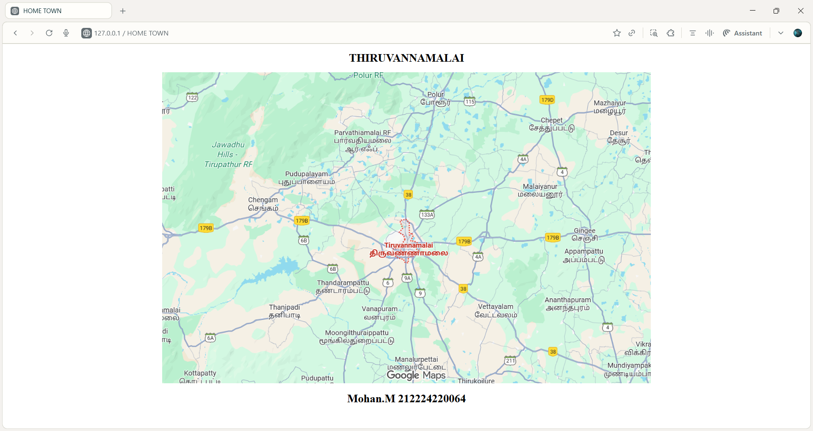
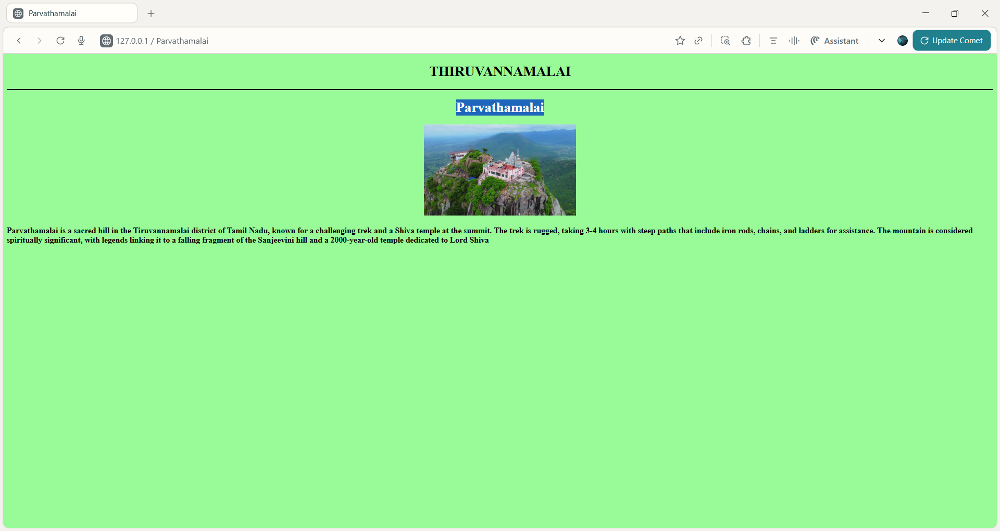
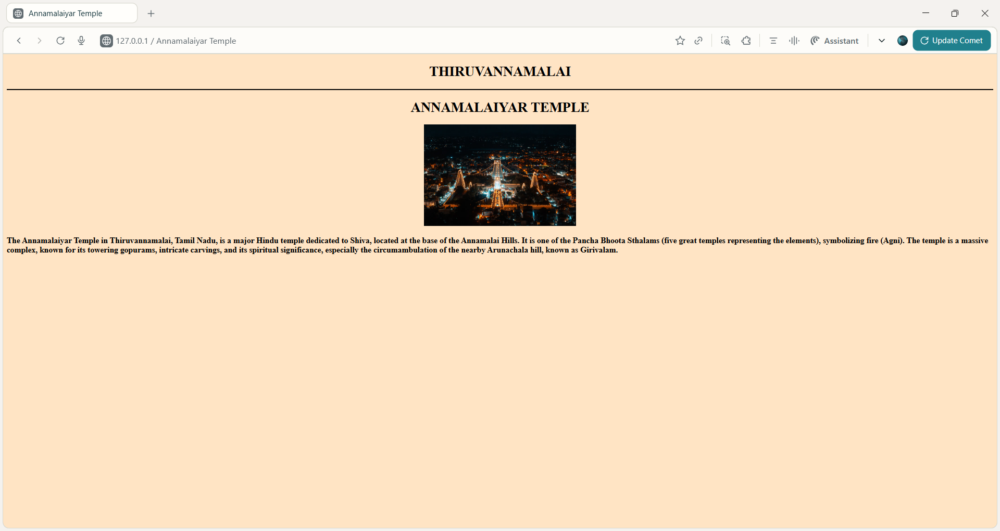

# Ex04 Places Around Me
## Date: 10:11:2025

## AIM
To develop a website to display details about the places around my house.

## DESIGN STEPS

### STEP 1
Create a Django admin interface.

### STEP 2
Download your city map from Google.

### STEP 3
Using ```<map>``` tag name the map.

### STEP 4
Create clickable regions in the image using ```<area>``` tag.

### STEP 5
Write HTML programs for all the regions identified.

### STEP 6
Execute the programs and publish them.

## CODE
## falls.html
```
<!DOCTYPE html>
<html lang="en">
<head>
    <meta charset="UTF-8">
    <meta name="viewport" content="width=device-width, initial-scale=1.0">
    <title>Urgoundanur Falls</title>
</head>
<body style="background-color: aqua;"> 
    <h1 style="text-align: center;">THIRUVANNAMALAI</h1>
    <hr color="black">
    <center><h1>URGOUNDANUR FALLS</h1></center>
    <center></center>
    <h3>Urgoundanur Falls in Thiruvannamalai is a tourist attraction known for its waterfalls, offering a "great water fall" experience. It is a free-to-enter location with no admission fee or tickets required. However, the area is not wheelchair accessible, and public transport is limited, making it difficult to reach beyond a certain point. </h3>
    
</body>
</html>
```
## map.html
```<!DOCTYPE html>
<html lang="en">
<head>
    <meta charset="UTF-8">
    <meta name="viewport" content="width=device-width, initial-scale=1.0">
    <title>HOME TOWN</title>
    
</head>
<body>
    <h1 align="center">THIRUVANNAMALAI</h1>
    <center>
        
        <map name="MyCity">
            <area shape="rect" coords="234,110,294,124" title="falls" href="falls.html">
            <area shape="rect" coords="693,506,748,474" title="Annamalaiyar temple" href="Temple.html">
            <area shape="rect" coords="415,520,377,546" title="Sathanur Dam" href="SathanurDam.html">
            <area shape="rect" coords="534,154,582,212" title="parvathamalai" href="parvathamalai .html">
        </map>
    </center>
    <center><footer><h1>Mohan.M 212224220064</h1></footer></center>
</body>
</html>
```
## parvathamalai.html
```<!DOCTYPE html>
<html lang="en">
<head>
    <meta charset="UTF-8">
    <meta name="viewport" content="width=device-width, initial-scale=1.0">
    <title>Parvathamalai</title>
</head>
<body style="background-color: palegreen;">
    <center><h1>THIRUVANNAMALAI</h1></center>
    <hr color="black">
    <center><h1>Parvathamalai </h1></center>
    <center></center>
    <h3>Parvathamalai is a sacred hill in the Tiruvannamalai district of Tamil Nadu, known for a challenging trek and a Shiva temple at the summit. The trek is rugged, taking 3-4 hours with steep paths that include iron rods, chains, and ladders for assistance. The mountain is considered spiritually significant, with legends linking it to a falling fragment of the Sanjeevini hill and a 2000-year-old temple dedicated to Lord Shiva</h3>
</body>
</html>
```
## sathanur dam.html
```<!DOCTYPE html>
<html lang="en">
<head>
    <meta charset="UTF-8">
    <meta name="viewport" content="width=device-width, initial-scale=1.0">
    <title>Sathanur Dam</title>
</head>
<body style="background-color: lightpink;">
    <center><h1>THIRUVANNAMALAI</h1></center>
    <hr color="black">
    <center><h1>SATHANUR DAM</h1></center>
    <center></center>
    <h3>Sathanur Dam is a major reservoir and tourist spot in Tamil Nadu, built in 1958 across the Thenpennai River near Tiruvannamalai. It is the third-largest dam in the state and is vital for irrigating thousands of acres and supplying drinking water. The site is popular with visitors for its picturesque setting, parks, gardens, and a crocodile farm</h3>
</body>
</html>
```
## temple.html
```<!DOCTYPE html>
<html lang="en">
<head>
    <meta charset="UTF-8">
    <meta name="viewport" content="width=device-width, initial-scale=1.0">
    <title>Annamalaiyar Temple</title>
</head>
<body style="background-color: bisque;">
    <center><h1>THIRUVANNAMALAI</h1></center>
    <hr color="black">
    <center><h1>ANNAMALAIYAR TEMPLE</h1></center>
    <center></center>
    <h3>The Annamalaiyar Temple in Thiruvannamalai, Tamil Nadu, is a major Hindu temple dedicated to Shiva, located at the base of the Annamalai Hills. It is one of the Pancha Bhoota Sthalams (five great temples representing the elements), symbolizing fire (Agni). The temple is a massive complex, known for its towering gopurams, intricate carvings, and its spiritual significance, especially the circumambulation of the nearby Arunachala hill, known as Girivalam.</h3>
</body>
</html>
```
## OUTPUT

## map



## falls


## parvthamalai



## sathanur dam


## temple




## RESULT
The program for implementing image maps using HTML is executed successfully.
